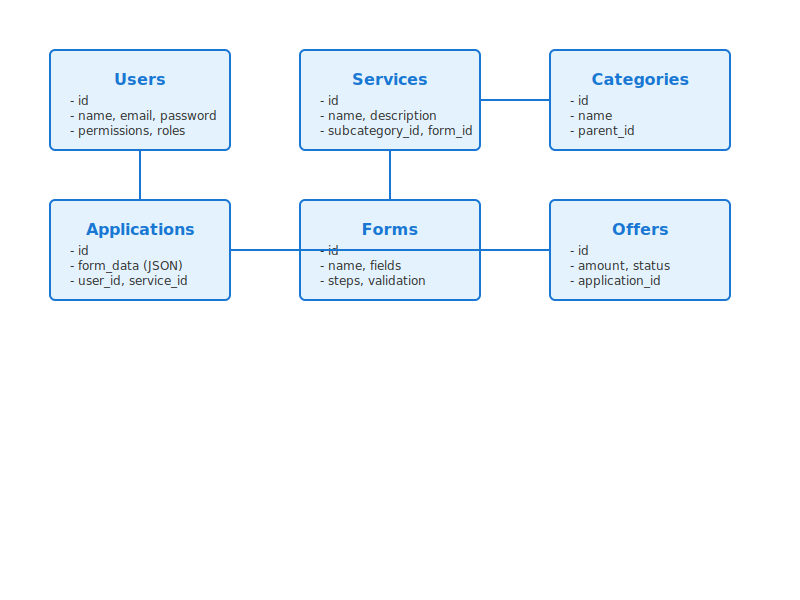

# Servio - Professional Service Marketplace

A Laravel-based marketplace platform connecting service providers with clients. Built with scalability and user experience in mind.



## 🚀 Features

- **User Management**
  - Multi-role system (Provider/Client)
  - Profile management
  - Authentication via Jetstream

- **Service Marketplace**
  - Dynamic service categories
  - Custom form builder
  - File attachments
  - Rating system

- **Admin Panel (Orchid Platform)**
  - Comprehensive dashboard
  - User management
  - Content management
  - System settings
  - Role-based access control

## 🛠️ Tech Stack

- PHP 8.0.2+
- Laravel 9.x
- MySQL/MariaDB
- Livewire
- Jetstream
- Orchid Platform

## ⚙️ Installation

1. Clone the repository
```bash
git clone https://github.com/tolgatasci/servio.git
cd servio
```

2. Install PHP dependencies
```bash
composer install
```

3. Install and compile frontend dependencies
```bash
npm install && npm run dev
```

4. Configure environment
```bash
cp .env.example .env
php artisan key:generate
```

5. Update database configuration in .env
```env
DB_CONNECTION=mysql
DB_HOST=127.0.0.1
DB_PORT=3306
DB_DATABASE=servio
DB_USERNAME=root
DB_PASSWORD=
```

6. Run migrations and seeders
```bash
php artisan migrate
php artisan db:seed
```

7. Set up storage
```bash
php artisan storage:link
```

8. Install Orchid Platform
```bash
php artisan orchid:install
```

9. Create admin user for Orchid
```bash
php artisan orchid:admin admin admin@admin.com password
```

10. Add Orchid Provider to config/app.php
```php
'providers' => [
    // ...
    Orchid\Platform\Providers\FoundationServiceProvider::class,
    // ...
];
```

## 📁 Project Structure

```
servio/
├── app/
│   ├── Orchid/
│   │   ├── Layouts/
│   │   ├── Screens/
│   │   └── PlatformProvider.php
│   ├── Http/
│   ├── Models/
│   └── Services/
├── database/
│   ├── migrations/
│   └── seeders/
├── resources/
│   ├── views/
│   └── js/
└── routes/
    └── web.php
```

## 🔐 Security

- Enable HTTPS in production
- Set proper file permissions
- Configure CSRF protection
- Regular security updates
- Backup strategy

## 📊 Database Schema

### Core Tables
- `users`: User management with roles
- `services`: Service listings and details
- `categories`: Service categorization
- `applications`: Service applications
- `forms`: Dynamic form builder
- `offers`: Service proposals and negotiations

### Supporting Tables
- `attachments`: File management
- `settings`: System configuration
- `notifications`: User notifications
- `messages`: Communication system

## 🌐 Localization

- Multi-language support
- RTL support
- Timezone handling
- Currency conversion

## 📝 License

This project is licensed under the MIT License - see the [LICENSE](LICENSE) file for details.

## 👤 Author

**Tolga Tasci**
* GitHub: [@tolgatasci](https://github.com/tolgatasci)

## 🙏 Acknowledgments

- Laravel Team
- Orchid Platform Team
- All contributors

## 💡 Support

For support, email tolgatasci1@gmail.com or join our Slack channel.
